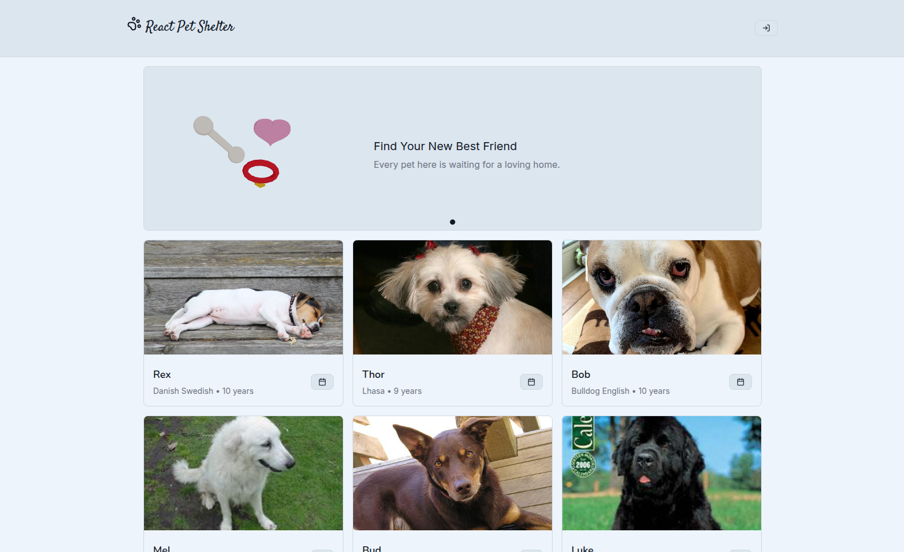
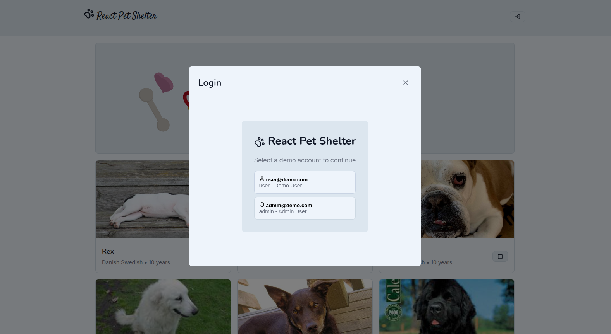
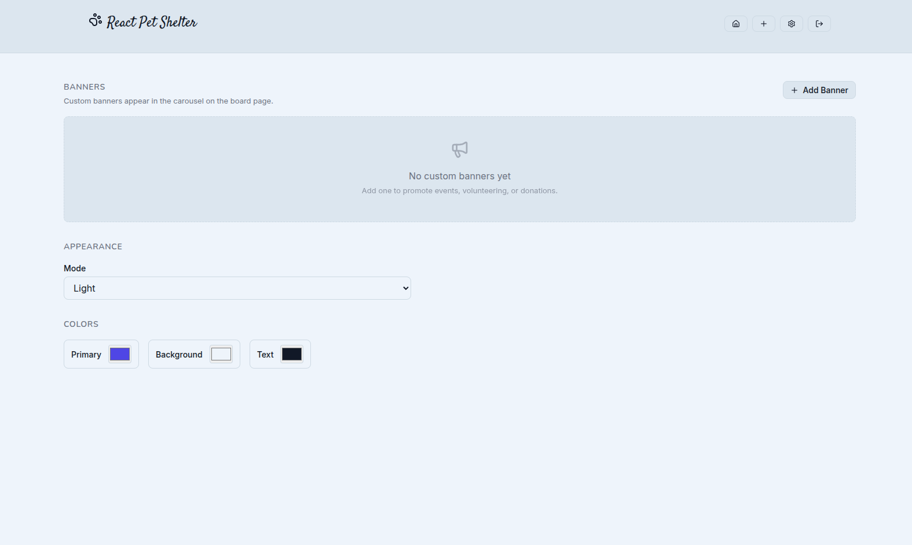
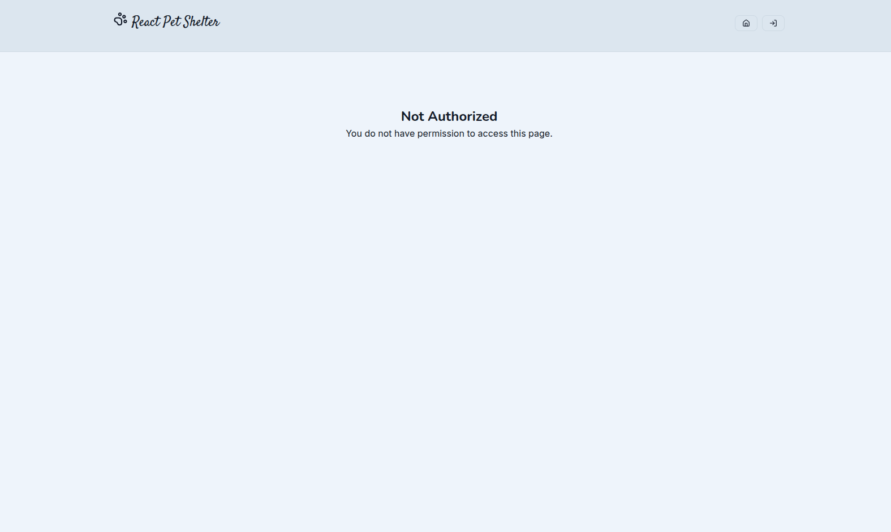
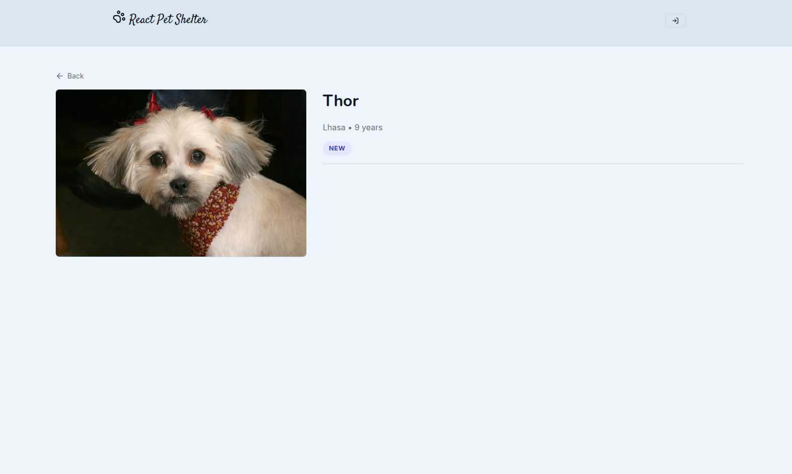
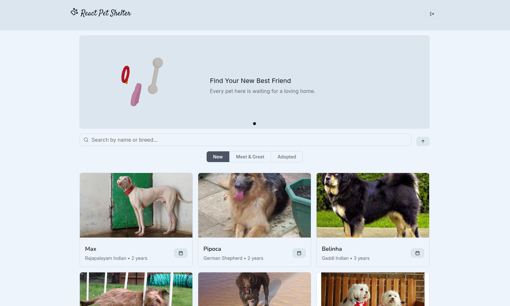
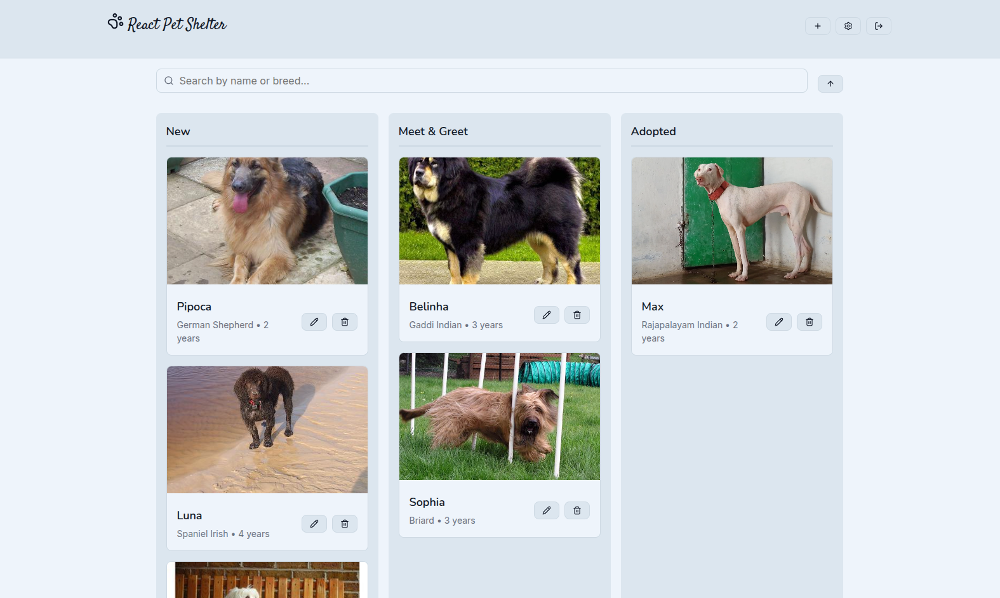
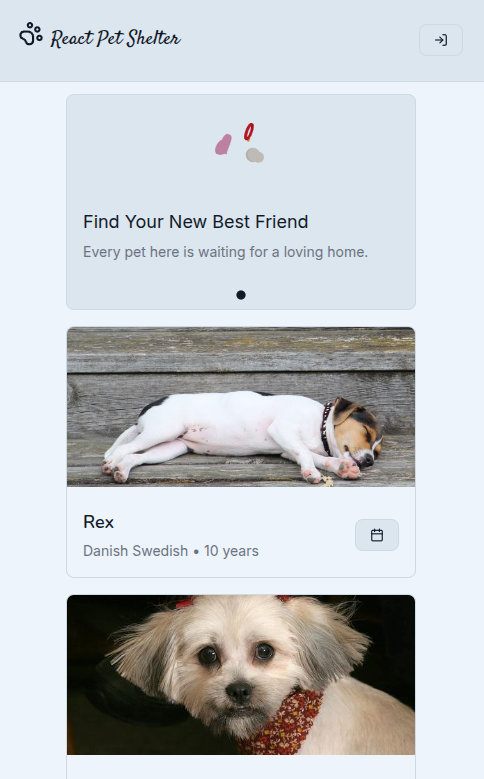
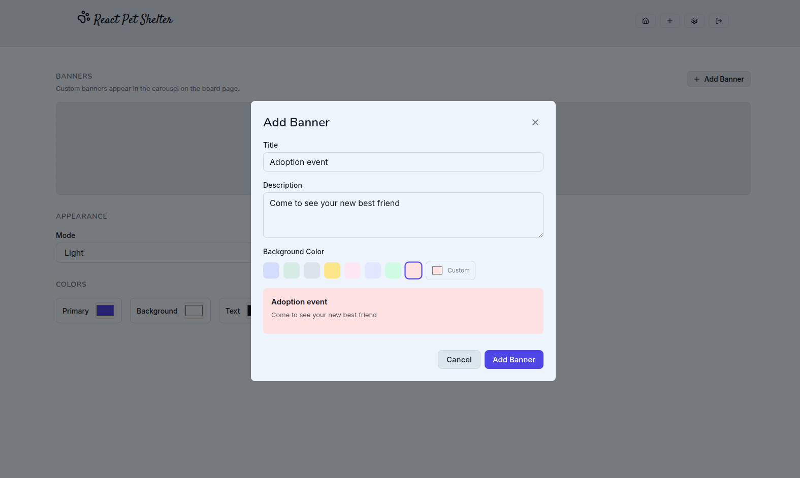
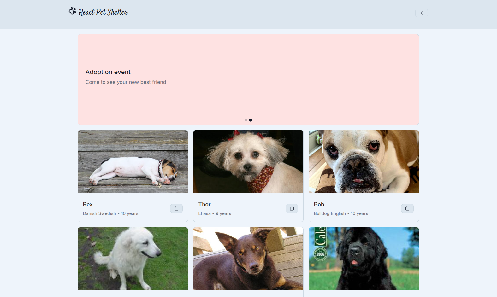

# KOBRA FRONTEND 1

<p align="left">
  <br/>
  <br/>
  <br/>
  <br/>
   <br/>
   <br/>
  <br/>
  
</p>

React reference project demonstrating patterns that apply to any real-world app: typescript, centralized state with `useReducer`, context API for globally-consumed data, role-based conditional rendering on the homepage, route-level authorization via React Router, custom hooks for persistence, native browser APIs over libraries, and mobile-first CSS architecture — all without UI or state management libraries.




## Features

- Mock JWT authentication: guest, user, and admin roles from a single codebase
- Guest mode: browse New pets; interacting prompts login
- User view: filtered grid with status tabs (New / Meet & Greet / Adopted)
- Admin view: kanban board with native HTML5 Drag & Drop, CRUD, and settings page
- Pet detail page: standalone `/adopt/:petName` route with role-based actions
- Dog CEO API: breed list → breed-specific images, cached in localStorage
- Search and sort-by-age with persistence
- Live theme customization: primary, background, text colors, and light/dark mode
- Three.js 3D hero banner: toon-shaded animation, responsive layout, theme-aware transparency
- Custom component library: Button (with icon prop), Card, Input, Select, Modal, Toast, Skeleton
- Form validation with inline errors and auto-focus
- 109 tests in 15 files (Vitest + React Testing Library)

## Architecture

```
src/
├── components/
│   ├── auth/          # LoginForm, AuthGuard
│   ├── layout/        # Header, BannerCarousel, PetScene
│   ├── pets/          # PetCard, PetBoard, PetForm
│   ├── admin/         # BannerManager
│   ├── theme/         # StyleCustomizer
│   └── ui/            # Button, Card, Input, Select, Modal, Toast
├── pages/             # BoardPage, SettingsPage, PetDetailPage
├── context/           # ThemeContext (provider + useTheme hook)
├── hooks/             # localStorage persistence
├── state/             # reducer.ts
├── styles/            # global.css + ui.css (BEM, mobile-first)
├── utils/             # auth, dogApi, constants
└── test/              # test-utils + 15 test files
```

## TypeScript

Entire codebase is TypeScript with `strict: true`. Types are not an afterthought — the reducer actions are a discriminated union (`AppAction`), the state shape is a single interface (`AppState`), and every component's props are explicitly typed. This catches mismatched payloads at compile time (passing a `string` where the reducer expects `{ id: string; status: string }` fails the build), makes refactoring safe, and serves as living documentation of the data flow. No `any` escapes.

## State Model

```javascript
{
  pets: [{
    id, name, breed, breedPath, estimatedAge,
    status: 'New' | 'Meet & Greet' | 'Adopted',
    photoUrl, createdAt
  }],
  filters: { search, statusFilter, sort: 'age_asc' | 'age_desc' },
  theme: { primaryColor, backgroundColor, textColor, mode: 'light' | 'dark' },
  user: { email, role, name, iat, exp } | null,
  toasts: [{ id, message, type }]
}
```

localStorage keys: `pet_shelter_pets`, `pet_shelter_filters`, `pet_shelter_theme`, `pet_shelter_auth_token`, `pet_shelter_dog_images_cache`, `pet_shelter_breeds`.

> This is a frontend-only demo. In production, pet data would live in a database (PostgreSQL, MongoDB, etc.), images would be served from a CDN, and auth would use real JWT with a backend API. localStorage here demonstrates state hydration, persistence, and graceful fallback patterns.

## Auth & Roles

The app opens as a guest experience — anyone can browse without an account. Logging in unlocks role-specific features:



Mock JWT is a base64-encoded JSON payload. `parseMockJWT` decodes, validates expiration, and returns the user:

```js
// utils/auth.js
function parseMockJWT(token) {
  const [, payload] = token.split('.')
  const decoded = JSON.parse(atob(payload))
  if (Date.now() >= decoded.exp * 1000) return null
  return decoded
}
```

On login, the token is stored in localStorage and dispatched to the reducer. The `user` slice drives role-based rendering on the homepage and route guards on protected pages.

### Routing

The app uses **React Router** for URL-based navigation. The homepage (`/`) uses conditional rendering for admin/user/guest experiences. The settings page (`/settings`) is a separate route protected by an `AuthGuard`. The pet detail page (`/adopt/:petName`) shows a standalone pet view with role-based actions.

```tsx
// App.tsx — routes
<Routes>
  <Route path="/" element={<BoardPage ... />} />
  <Route path="/settings" element={<SettingsPage ... />} />
  <Route path="/adopt/:petName" element={<PetDetailPage ... />} />
</Routes>
```

Conditional rendering is scoped to the homepage (`BoardPage.tsx`) where it makes sense — three experiences from one route:

```tsx
// pages/BoardPage.tsx — one component, three experiences
{state.user?.role === 'admin' ? (
  <AdminView />           // Kanban + DnD + CRUD
) : state.user ? (
  <UserView />            // Filtered grid + status tabs
) : (
  <GuestView />           // Browse-only, login prompt on action
)}
```

The settings route uses route-level authorization instead of conditional rendering:

```tsx
// pages/SettingsPage.tsx
<AuthGuard user={state.user}>
  <SettingsContent />     // Admin sees full settings
</AuthGuard>
// Non-admins see "Not Authorized" from AuthGuard's fallback
```



When a non-admin user navigates to `/settings`, the `AuthGuard` blocks access entirely and renders a fallback instead:



The pet detail route (`/adopt/:petName`) matches a pet by name and renders role-based actions inline:

```tsx
// pages/PetDetailPage.tsx
const pet = state.pets.find(p => p.name.toLowerCase() === petName?.toLowerCase())

if (!pet) return <NotFound />

// Guest: photo + info only
// User:  photo + info + "Meet & Greet" button (if status is New)
// Admin: photo + info + move to any of the 3 statuses
```

Clicking a pet card on the board navigates to `/adopt/:petName` via `useNavigate`. Action buttons (Edit, Delete, Meet & Greet) are excluded from the click handler to preserve their existing behavior.



The three roles shape the entire experience — after logging in, users and admins each get a tailored homepage:

| | Guest | User | Admin |
|---|---|---|---|
| Browse New pets | ✓ | ✓ | ✓ |
| All statuses + sort | — | ✓ | ✓ |
| Pet detail page | View only | View + Meet & Greet | View + move status |
| Schedule Meet & Greet | Login prompt | ✓ (button) | ✓ (DnD) |
| Drag & drop | — | — | ✓ |
| CRUD + settings | — | — | ✓ |



Admins get the most powerful interface — a kanban board with drag-and-drop to move pets between statuses:



## Hook Decisions

### useReducer (App.tsx)

Single reducer handles all state: pets, filters, theme, auth, toasts.

When state slices depend on each other — filtering depends on pets, theme affects the entire UI, auth determines which components render — splitting them across `useState` calls leads to cascading updates, stale closures, and scattered logic. A reducer centralizes all transitions in one place, makes every state change traceable (each action type is greppable), and enables testing state logic without mounting components. The dispatch function is stable across renders, so it can be passed down without causing re-renders.

```js
// state/reducer.ts — every state change is a typed action
function reducer(state, action) {
  switch (action.type) {
    case 'MOVE_PET':
      return {
        ...state,
        pets: state.pets.map(pet =>
          pet.id === action.payload.id
            ? { ...pet, status: action.payload.status }
            : pet
        )
      }
    case 'SET_THEME':
      return { ...state, theme: { ...state.theme, ...action.payload } }
    // ... 13 actions total
  }
}
```

### useEffect

Three distinct use cases, each with a single responsibility:

1. **Theme sync** — applies CSS custom properties to `<html>` via `style.setProperty`
2. **Initialization** — fetches breeds, assigns to pets, then loads breed-specific images — all in one sequenced effect
3. **Persistence** — custom hooks sync state slices to localStorage:

```js
// hooks/useLocalStorage.js
function usePersistPets(pets) {
  useEffect(() => {
    localStorage.setItem(STORAGE_KEYS.PETS, JSON.stringify(pets))
  }, [pets])
}
```

### useState

Reserved for local UI state: modal visibility, form inputs, drag-over tracking. Kept out of the reducer to avoid noise.

### useRef

- `Modal.tsx` — dialog element reference + previous focus restoration
- `PetForm.tsx` — focus first invalid field on validation error
- `App.tsx` — `initializedRef` prevents duplicate API calls

### useId

Used in `Input` and `Select` for SSR-safe `id`/`htmlFor` linking.

## Memoization Policy

No `useMemo`, `useCallback`, or `React.memo` are used.

React 19 includes the React Compiler (opt-in via `babel-plugin-react-compiler`), which automatically memoizes components, hooks, and callbacks at build time — eliminating the need for manual memoization in most cases. Even without the compiler enabled, this project's state structure already avoids the main triggers for unnecessary re-renders: the reducer returns new objects only on actual changes, dispatch is stable, and UI state lives close to where it's consumed.


## Dog CEO API

- `GET /breeds/list/all` — flattened into `{ name, path }` objects, cached
- `GET /breed/{path}/images/random` — breed-specific photos
- `GET /breeds/image/random/{count}` — fallback when breed-specific fails

Breeds and image URLs cached in localStorage. On API failure, cached data + toast notification.

## Responsive Design

Mobile-first, single `min-width: 768px` breakpoint. Base styles target phones; tablet+ enhances layout, spacing, image sizes. Grids use `auto-fill` / `auto-fit` with `minmax()`. Touch-friendly button sizing on mobile with desktop refinement.



## Drag & Drop

`dragStart` encodes `{ petId, sourceStatus }` via `dataTransfer`. Column `onDragOver` / `onDrop` decode and dispatch `MOVE_PET`.

The interaction is straightforward — move a card between three columns, no reordering within a column. HTML5 Drag & Drop handles this with four native events (`dragStart`, `dragOver`, `dragLeave`, `drop`) and a single `dataTransfer` payload. Libraries like `dnd-kit` or `react-beautiful-dnd` add bundle size, abstraction layers, and API surface for features this app doesn't need (sorting, nested lists, multi-axis). Using the platform keeps the implementation at ~30 lines and makes the data flow explicit: drag encodes, drop decodes, reducer updates. For complex UIs with reordering, animations, or touch support, a library would be the right tradeoff.

```js
// PetCard.tsx — encode on drag
e.dataTransfer.setData('text/plain', JSON.stringify({
  petId: pet.id,
  sourceStatus: pet.status
}))

// PetBoard.tsx — decode and dispatch on drop
const { petId, sourceStatus } = JSON.parse(e.dataTransfer.getData('text/plain'))
if (sourceStatus !== targetStatus) {
  dispatch({ type: 'MOVE_PET', payload: { id: petId, status: targetStatus } })
}
```

## Banner System

The banner carousel has a **hybrid content model**: one static, hardcoded banner sits at index zero, and admin-created banners are appended after it. The static banner owns the 3D scene; custom banners are plain colored slides with a title and description.

### Static banner (`STATIC_BANNER`)

```ts
const STATIC_BANNER = {
  id: 'adopt',
  title: 'Find Your New Best Friend',
  description: 'Every pet here is waiting for a loving home. Start browsing today.',
  color: '#d4dcfc',
} as const
```

This object lives at module scope in `BannerCarousel.tsx`. It never enters the reducer, never gets persisted, and is never editable through the admin UI. The carousel composes the full slide list at render time:

```ts
const allBanners = [STATIC_BANNER, ...banners]
```

The `id === 'adopt'` check gates the 3D scene — only the static slide gets `<PetScene />`. Admin banners render a plain `<motion.div>` with `backgroundColor: slide.color`. This means the bundle cost of Three.js is **only paid when the user is on the hero slide**. During autoplay transitions to admin slides, the 3D canvas unmounts cleanly.



### Admin banners

Created through `BannerManager.tsx` — a CRUD form with a color picker (preset swatches + custom hex), title text, and description text. Banners are stored in the reducer (`state.banners`) and persisted to localStorage alongside pets and filters.



```
BannerManager
  ├── Banner list (preview cards with inline edit/delete)
  ├── Add Banner modal (color + title + description form)
  └── Edit Banner modal (pre-filled form)
```

A fully static carousel is inflexible. A fully dynamic carousel (all banners editable) risks the user deleting the hero banner, leaving an empty carousel or a jarring first impression. The hybrid approach guarantees the hero banner always exists while still allowing admins to add announcements, promotions, or seasonal messages. It's a minimal guard — no ACL, no role check, just a constant that can't be deleted.

Within the board page, a ternary branches by role:

```tsx
// pages/BoardPage.tsx
{state.user?.role === 'admin' ? <AdminBoard /> : state.user ? <UserBoard /> : <GuestBoard />}
```

- The homepage is one route with three experiences — conditional rendering keeps the branching explicit
- The settings route uses `AuthGuard` for authorization — a separate route with a gate, not conditional rendering
- State transitions (`LOGIN`, `LOGOUT`) re-evaluate the same component tree — no navigation events needed


**Sub-panel pattern (User view):**
The user board has a local `userStatus` state driving a segmented control. This is a second layer of conditional rendering — tabs within a panel — handled locally because it doesn't need to survive navigation or persist across sessions.

```
Guest panel:  banner → pet grid (New only)
User panel:   banner → filters + tabs → filtered pet grid
Admin panel:  admin filters → kanban board (no banner)
```

## Three.js Banner

The static banner (`BannerCarousel.tsx`) renders a `<canvas>`-based 3D scene via Three.js when displaying the hero slide. Admin-created banners fall back to the original solid-color background — the 3D layer is opt-in, per-slide.

**Stack:**
- `three` — WebGL primitives (geometries, materials, lights)
- `@react-three/fiber` — React reconciler for Three.js (declarative scene graph)
- `@react-three/drei` — utility components (`Float` for idle animation)

**Scene composition** (`PetScene.tsx`):
```
Bone (spheres + cylinder, ~36° tilt)
Heart (extruded Bézier shape, pink)
Collar (torus + tag, red/gold)
→ Orbiting together in a "waltz" group
```

Each item orbits around a shared center (`useFrame` rotating a parent group on Y), with a slow sinusoidal drift on X and Y. Individual items get `<Float>` wrappers for subtle idle bob.

**Layout integration:**
The 3D scene lives inside the banner's flex layout, not as an absolute overlay:

The canvas is rendered with `alpha: true` and no explicit background color, inheriting `var(--bg-secondary)` from the viewport div behind it. This means the 3D scene seamlessly blends with the banner background across light and dark themes.

**Performance notes:**
- Geometry and materials are created at module scope — no runtime allocations per frame
- `dpr={[1, 1.5]}` caps pixel ratio for high-DPI screens, keeping fill rate manageable
- Orbit radius stays within `[-1.1, 1.1]` — all objects remain in view without frustum culling churn
- The canvas only mounts for the static hero slide; admin banners skip it entirely
- At ~180KB gzipped (Three.js + fiber + drei), this is a calculated cost. For a single-banner 3D accent, it's acceptable. For a full 3D experience, lazy-loading the entire scene behind `React.lazy` would trim the initial bundle.

## Animation

**Lucide React** — tree-shakable SVG icons. Each icon imports individually; the bundle only includes what's used. Passed to `Button` via an `icon` prop with correct sizing per variant. `aria-label` on icon-only buttons preserves accessibility. Lucide was chosen because it has consistent API, no sprite sheet, no font file. Inline SVGs would work but add maintenance overhead at scale.

**Framer Motion** — handles three things CSS can't easily do: exit animations (`AnimatePresence` keeps elements mounted until the animation completes), staggered card entrances (`custom` prop with per-index delay), and `whileTap` tactile feedback. Layout animations (`layout` prop) smoothly reorder cards when pets change status. CSS can animate entry but not exit (once removed from DOM, the element is gone). Stagger delays and layout animations require significant JS workarounds in pure CSS. At ~30KB gzipped, the cost is justified for the UX improvement.

## Theme System

Theme values are part of the reducer (`theme` slice in `AppState`) and exposed globally through `ThemeContext` rather than passed as props. 

Theme is ambient — consumed by the DOM itself via CSS custom properties, not by a specific component branch. Threading it through props would mean dozens of intermediates accepting values they never read. Context eliminates that overhead.

State scoped to a feature branch (pets, filters, user) stays in props because the data path is explicit: `App → PetBoard → PetCard` is traceable. A `usePets()` context hook would make data appear from nowhere — convenient but opaque.

Context for globally-consumed data, props for scoped data. Theme, locale, auth session belong in providers. Feature CRUD goes through the tree.

## Testing

109 tests across 15 files.

| Layer | Tool | Coverage |
|---|---|---|
| Unit | Vitest | Reducer actions, auth logic, localStorage hooks |
| Component | React Testing Library + user-event | All UI components + feature components |
| App.tsx | RTL + React Router | App.tsx auth flow, persistence, modals |

E2E (Playwright/Cypress) were not included. They're valuable for critical user flows but add significant CI time and maintenance burden. For a frontend-only demo with mocked APIs, component + integration tests cover the same logic faster and more reliably. E2E would be the next layer once a real backend exists.

## Run

```bash
npm install
npm run dev       # http://localhost:5173
npm run build
npm run lint
```

Demo: `user@demo.com` / `admin@demo.com`
